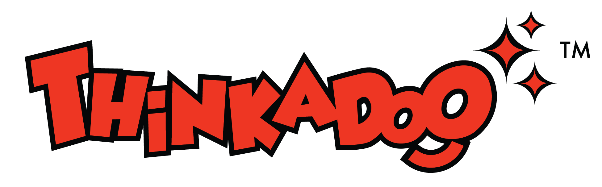

<p align="center">
  
</p>

# Thinkadoo

Thinkadoo is a children's craft-kit and workshop brand that turns imagination, art and creative discovery into screen-free hands-on experiences for children.

This repository holds the **design exploration** for the Thinkadoo public website: the product and design docs, plus four standalone HTML homepage concepts to compare. No visual direction has been chosen yet, and the architecture has not been decided. There is no production frontend.

## What's here

```
docs/
  concepts/        Four HTML homepage concepts, a review board, and a structural check
    index.html     Review board comparing the four concepts
    01-makers-table.html
    02-playroom.html
    03-craft-journal.html
    04-paper-theatre.html
    verify.mjs     Static structure and JavaScript check for the four concepts
    assets/        Thinkadoo wordmarks and one concept illustration (see assets/README.md)
  design/
    PRODUCT.md           Audience, purpose, constraints and open decisions
    DESIGN.md            Shared design system: palette, type, layout, motion, do's and don'ts
    website-concepts.md  The concept contract: shared scope and per-concept brief
  plans/           Execution plan for the concept exploration
  research/        Study of the five reference websites
  workflows/       Gate profile for building and reviewing the concepts
frontend/          Reserved for the production frontend. Empty, so git doesn't track it yet.
```

## The four concepts

| # | Concept | Idea |
|---|---------|------|
| 01 | The maker's table | Overhead craft desk. An "Open the kit" control unpacks and assembles the kit. |
| 02 | The playroom | Cobalt typographic play space with a toy shelf and Make / Paint / Play modes. |
| 03 | The craft journal | Editorial publication and storefront with a stamp/colour interaction. |
| 04 | The paper theatre | Panoramic cut-paper stage with chapter navigation. |

All four use the supplied red and yellow wordmarks unchanged and the seven source colours: red `#ef3a24`, yellow `#fcda00`, teal `#32c3e0`, green `#5cba47`, blue `#2960ad`, deep blue `#201b4a` and ink `#221f1f`.

## Viewing the concepts

The pages are static HTML with no build step. Serve the project root and open the review board:

```bash
python3 -m http.server 4173 --bind 127.0.0.1
```

Then visit <http://127.0.0.1:4173/docs/concepts/>.

## Checking the concepts

`verify.mjs` checks each concept for document language, viewport, landmarks, a single `h1`, reduced-motion and focus handling, anchors that resolve, no dead `#` links, no live payment SDK, and valid inline JavaScript syntax. It needs Node and has no dependencies.

```bash
node docs/concepts/verify.mjs
```

Browser checks (interactions, mobile layouts, reduced motion) are separate and done by hand in a browser.

## Prototype boundaries

These are visual prototypes, not a store:

- Nothing takes orders, payments or bookings, and nothing collects personal data. Checkout controls are disabled and say so.
- The example kits (The Great Indian Mela Truck, Paint My God), their descriptions and the workshop activities are provisional. No prices, ages, dates, locations or policies are confirmed.
- Illustrations are concept art made for this exploration. They are not photographs of real products.

Final catalogue, photography, commerce, workshop logistics, architecture and the chosen direction are still open. [PRODUCT.md](docs/design/PRODUCT.md) tracks them.

## Working in this repo

Docs come before code. Changes to the concepts start with [website-concepts.md](docs/design/website-concepts.md) and [DESIGN.md](docs/design/DESIGN.md), and implementation follows the updated contract. Keep design and planning material in `docs/` and leave `frontend/` empty until a direction is chosen.
